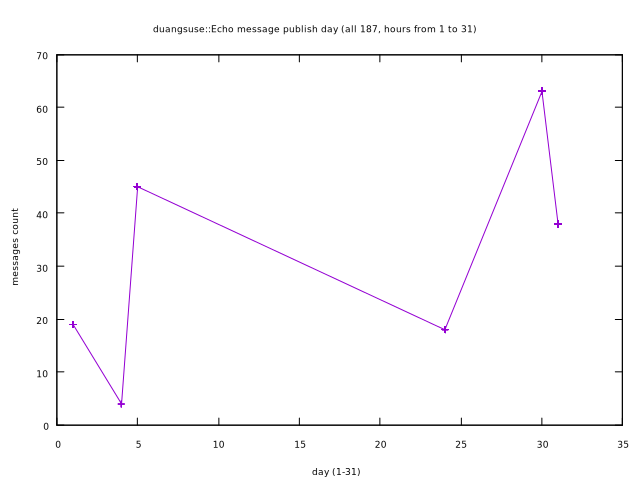
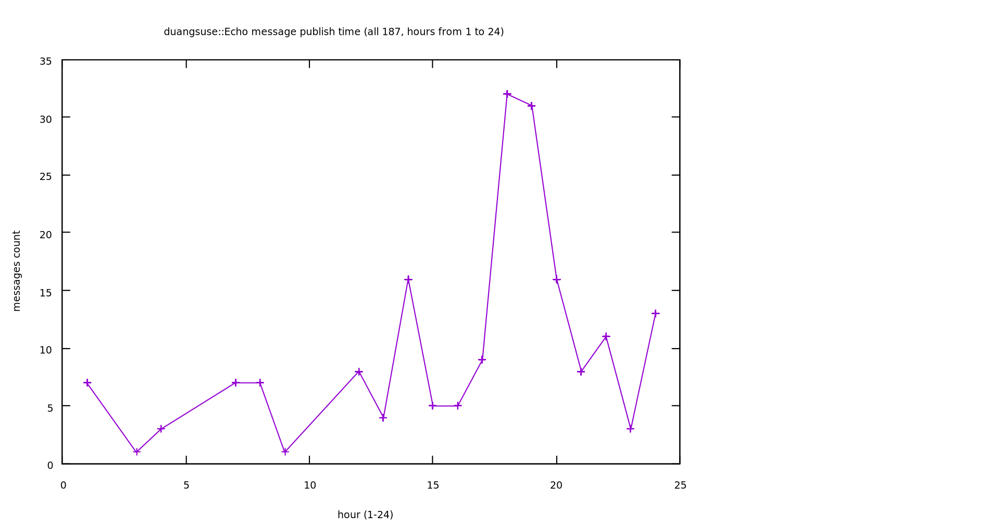

# Python-ML-intro [original](https://t.me/dsuse/10755) [📔](CONTENT.md)

《零起点 Python 机器学习快速入门》：复制的简易机器学习入门 Iris 数据集线性回归

作者是一个做中文字库的（字王工作室），自产有[《中华大字库》](http://www.topquant.vip/?cat=16)、TopQuant 足彩分析等，也是一个其他信息行业奠基者的角色，（对我来说）是个先辈，但是他对程序设计的理解有点独特但不是很深刻，书上的图示、算法接口资料还比较齐全，
示例数据集主要讲的是 Iris 爱丽丝花卉子种属数据集，以及一个 CCPP 发电厂电力输出数据集。

全本书讲了 `sklearn` (scikit)、Pandas、Matplotlib 的使用，当然没有提到 Numpy、Numba、OpenCL、OpenMP、PyCUDA 等高性能计算库的使用（“黑箱”教学），但是提了名字

算法没有讲太多算法细节，只是给你几个封装函数做学习、测试数据切分 (`ai_data_cut`)、学习 (`mx_*`)、回归 (`predict` 方法)、测试 (`ai_acc_xed`) （用于判断数据预测的准确率，就是对 test 数据集，准备好预测到的结果，取实际 test 的结果，判断 (误差小于目标 _k_ 的结果项目份数/总份数)）

前面还教你如何进行『分类名称』“矢量”化（就不在这里喷这个名词使用的错误了[[^1]](#fn1)，虽然可能不是他自己最开始用的）...
这里不吐槽任何槽点，但是本书的槽点还是很多的，看上 100 面大概能找到十七八个，不过不得不说对于机器学习入门来说这本书也不错（即使里面有些文字我打算专门吐槽一下...）。
再者，因为我这里绝对没有任何其他的机器学习书了...

###### <small>footnote</small>

<a name="fn1">^1</a> 矢量化：这里是指，对于一个数据表（书上的是 Iris 种属分类）
如果要学习（数据分析）的一项是（可能不可导、不可进行传统统计概率数值运算的）聚合量（[product type](https://en.wikipedia.org/wiki/Product_type)）比如一个 str （char 的 [homogenous product type](http://open-std.org/JTC1/SC22/WG21/docs/papers/2017/p0649r0.pdf)）那就先将其『标号化』、学习，再在回归的时候映射回来
矢量，在物理上是有方向的量[[^2]](#fn2)，数学上（尤其线性代数）矢量化是指[把矩阵转化为线性序列的形式](https://en.wikipedia.org/wiki/Vectorization_(mathematics))，请问这里它的宾语（目标）是指『这个数据表 `pandas.DataFrame`』呢？还是 Python 的 `<built-in type str>` 呢？
不管怎么样，看起来都有点不太对吧？哈？算了....

```matlab
vec(A) = {
  A[1,1], ..., A[m,1],
  A[1,2], ..., A[m,2],
  A[1,n], ..., A[m,n] }
```

简而言之就是把 2x2 矩阵 `{ a b;; c d }` 变成元组 `[ a c b d ]`, 看上面的递推式子也知道了

缺点当然是很明显的，比如 Iris 分类器的例子，作者就这么对三种种属『“矢量化”』了一波（取的『编号』，虽然那实际上是逼近的参数之一.... 都是 1,2,3 这种），Linear regression 的结果很差很辣鸡，只比随机三选一好一点。

然而实际上可以多准确呢？同数据集 kNN 分类器（k-最近邻分类法，最简单的机器学习算法之一，特征聚合映射到 _N_ 维空间判距离上 _k_ 最近邻中数目最多的分类，用作者的话，当然我觉得还行的就是『物以类聚』）学习后给出的判断准确率是 100%！

（但是，实际测试的时候这里准确率都接近 100%... 可能是训练测试数据集不同吧）😑

何况，作者『映射』分类预测结果回来（实际上没有映射回 `str`，但这里和我说的实际上是一个情况）的时候使用的（浮点）算法是直接 truncate(`floor`) 掉小数部分然后 `if else if ...` （如果有可能的话这种风格不如 `switch ...`），还不如四舍五入（使用 Banker's rounding _(to even)_ `round`）好呢（不要忘记了这个『矢量』实际上代表的是一个分类！所以要特殊处理）

作者自己的确是做数据分析的，可是他对编程的理解.... 我觉得真的不是特别值得学习

我可没有随便对自己完全不理解的东西乱说话，至少我能找到一篇文章给我背书：

[Conmajia::CodeProject::前馈全连接神经网络和函数逼近、时间序列预测、手写数字识别](https://www.cnblogs.com/conmajia/p/annt-feed-forward-fully-connected-neural-networks.html#%E9%B8%A2%E5%B0%BE%E8%8A%B1%E5%A4%9A%E7%B1%BB%E5%88%86%E7%B1%BB)这里面没有 Python 书里作者所谓的『矢量化』， 但只是学习模型的不同而已（[线性回归](https://zh.wikipedia.org/wiki/%E7%B7%9A%E6%80%A7%E5%9B%9E%E6%AD%B8) vs. 人工神经网络），不过 Sklearn 有 [one-hot encoding 的实现](https://scikit-learn.org/stable/modules/generated/sklearn.preprocessing.LabelEncoder.html)，作者还是要用『矢量化』定 1,2,3，明明说都到『CPU 加法器』的级别了，却连二进制都没注意到，也真是服气了....


```python
>>> from sklearn import preprocessing
>>> le = preprocessing.LabelEncoder()
>>> le.fit([1, 2, 2, 6])
LabelEncoder()
>>> le.classes_
array([1, 2, 6])
```

<a name="fn2">^2</a> 的时候搞错了... 物理上那个是向量，基本无关的东西

## 最终结论

\[In reply to duangsuse::Echo]

```bash
$ pip3 install -r requirements.txt #-q

Requirement already satisfied: pandas>=0.24.2 (0.24.2)
Requirement already satisfied: matplotlib>=3.1.0 (3.1.0)
Requirement already satisfied: scikit-learn>=0.21.2 (0.21.2)
Requirement already satisfied: python-dateutil>=2.5.0 (2.7.5)
Requirement already satisfied: pytz>=2011k (2018.5)
Requirement already satisfied: numpy>=1.12.0 (1.15.1)
Requirement already satisfied: pyparsing!=2.0.4,!=2.1.2,!=2.1.6,>=2.0.1 (2.2.0)
Requirement already satisfied: kiwisolver>=1.0.1 (1.0.1)
Requirement already satisfied: cycler>=0.10 (0.10.0)
Requirement already satisfied: scipy>=0.17.0 (1.1.0)
Requirement already satisfied: joblib>=0.11 (0.13.2)
Requirement already satisfied: six>=1.5 (1.11.0)
Requirement already satisfied: setuptools (40.8.0)
```

分类的准确性有点可怕...：

看来线性回归也... 😟 不过很可惜，`verifyRegressionAccuracy` 只支持数值表项，看来只能另外写准确率判断了：

```python
errors = testset[testset['w'] != testset['guess']]
```

In \[32]: 
```python
len(errors) / len(testset) * 100
```

Out\[32]: `8.333333333333332`

__8.3%__ 的错误率！

— Question: 同一个 linearreg，那原作者分类的准确率为啥那么低

因为我的『向量化』是 one-hot encoding （独热码编码）的啊！

如果我写完全等价的实践（1,2,3 + round），你猜准确率又是怎么样的？

首先我们的回归结果是转换为文字形式的，试试数值形式：

```python
from pandas import Series, read_csv
iris = read_csv('Iris.csv', encoding='utf-8', parse_dates=[], index_col=False)
iris['id'] = Series().astype(int)
```
—
```python
def vectorize(w,i, cname='w', cid='id', iris=iris): iris.loc[iris[cname]== w, cid] = i
vectorize('setosa', 0); vectorize('versicolor', 1); vectorize('virginica', 2)

from sklearn.model_selection import train_test_split
iris_ds = iris.copy()

trainset, testset, trainsetid, testsetid = train_test_split(iris_ds, iris_ds['id'], train_size = 0.6)
del trainset['w'], trainset['id']
```
—
```python
from sklearn.linear_model import LinearRegression
from math import floor

lreg = LinearRegression()
lreg.fit(trainset, trainsetid)

testset_truthw, testset_truthid = testset['w'], testset['id']
del testset['w'], testset['id']
testset['predict'] = lreg.predict(testset)
testset['id'] = testset_truthid
—
from pandas import DataFrame
def verifyRegressionAccuracy(ts: DataFrame, emax: float = 0.1, npredict = 'predict', ntruth = 'real') -> float:
  predicteds, truths = ts[npredict], ts[ntruth]
  acceptables = [t for (r, t) in zip(truths, predicteds) if abs(t - r) <emax]
  return (len(acceptables) / len(predicteds)) *100

verifyRegressionAccuracy(testset, 1.0, 'predict', 'id')
```

结果是误差 100% 在 1.0 以内。[[1]](#fn2-1)

== 然后再试一次：

```python
vectorize('setosa', 1); vectorize('versicolor', 2); vectorize('virginica', 3)
iris_ds = iris.copy()

trainset, testset, trainsetid, testsetid = train_test_split(iris_ds, iris_ds['id'], train_size = 0.6)

del trainset['w'], trainset['id']

lreg = LinearRegression()
lreg.fit(trainset, trainsetid)

testset_truthw, testset_truthid = testset['w'], testset['id']
del testset['w'], testset['id']

testset['predict'] = lreg.predict(testset)
testset['id'] = testset_truthid
```

— 修改后的逻辑

In \[14]: `verifyRegressionAccuracy(testset, 1.0, 'predict', 'id')`

Out\[14]: 100.0

我们的依然是 100%，然后 0.1 的误差是 48%

然后使用独到的 1,2,3,... 序列：

In \[23]: `verifyRegressionAccuracy(testset, 1.0, 'predict', 'id')`

Out\[23]: 100.0 然后 0.1 的误差是 45%

🥺 打脸了。好像完全可以算在误差内嘛...

— 实际情况

所谓打脸是因为我不知道作者要『矢量回归』还 `map` 了一次 `round`
至于 `round` 之后的误差（即使 `round` 的结果和之前绝对值线性距离计算的也有很大关系...）... 嘻嘻 🌝

```python
testset['predict'] = testset['predict'].map(round)
verifyRegressionAccuracy(testset, 1, 'predict', 'id')
```

结果是 96%... 好像又是差不多，欸奇怪了 🤔 真实无解
—
<a name="fn2-1">^1</a> 后来发现，我在训练的时候忘记删掉了 `id` 参数... 它好像找到了一个作弊的方式 🤪
虽然比较辣鸡的算法显然也不能把 `id` 的系数提高到多少... 但是线性回归或许可以猜出来？


## 最后

开始的四舍五入是误解，因为 `round` 的确默认四舍五入

但是『矢量化』数值标签的问题的确可能影响训练结果

实际上问题没有解决，没有所谓的优化，因为没办法确认是否真的有啥区别，而且数据量、测试的算法数目也不够大啊

但是作为比较简单幼稚（naïve 🐸）的机器学习入门来看还是可以的

>皮了一下午，那么就继续吧....
此书我寒假要找时间吐槽的，但是现在显然没有时间关心它
此书我已经看完了，剩下的内容也都已经阅读。

>用 [Sklearn](https://scikit-learn.org/stable/modules/classes.html) 之类的框架做机器学习并不困难，只要你有点基础知识就可以，作者也说了，算法细节？呵呵

>我们先用一个小数据集测试一下被抽象化的每个算法对预测的准确率，然后直接选好模型（虽然比较死，就是基于 Panda 数据表格的，差一点都不行，计算机视觉也不能搞）就开始上线... 然后... 就没有然后了

>然后书本上面还有一些其他算法（比如 kNN）的例子，可以自己去 Sklearn 那里看，教程很详细，先溜了。

## Matplotlib 基本使用

\[In reply to duangsuse::Echo]

还是 sin wave 之类的数据，matplotlib 可以[这么用](https://matplotlib.org/tutorials/introductory/sample_plots.html#sphx-glr-tutorials-introductory-sample-plots-py)：

导入
```python
from math import sin, cos, tan
from numpy import arange, array

from matplotlib import pyplot
from pandas import DataFrame, Series
```

初始化目标（要可视化的）数据
```python
xs = arange(0, 100, 0.1)
sinys = [sin(x) for x in xs]
cosys = [cos(x) for x in xs]
tanys = [tan(x) for x in xs]
```

```python
plot.style.use('Solarize_Light2')

DataFrame(array([[xs], [sinys], [cosys], [tanys]]), columns = 'x sin(x) cos(x) tan(x)'.split())... 不行

def kv(name): return (name, globals()[name])
func_tab = DataFrame.from_items(dict(kv(xs), kv(sinys), kv(cosys), kv(tanys)))... 不行

waves = DataFrame()
waves['x'] = xs
waves['sin(x)'] = sinys; waves['cos(x)'] = cosys; waves['tan(x)'] = tanys

waves.index.name = 'x'
waves.plot(title='Triangle waves')
```

就可以得到好看的 _折线图_ 了，并且非常容易使用

Pandas 的 `DataFrame` 就是字面意义上的数据框：一打可能有名字(`index`)的数据序列(`pandas.Series`)
只需要使用 EDSL（内部领域专属语言）操作它的实例就可以快速获得好看的数据图了，不需要不断去 plot 啊 add seris 再设置 xlabel ylabel 啊，都被良好封装（styles, chart type）了

上面[本频道](https://t.me/dsuse/9844)也有过 Ruby + GNUPlot 的版本

```ruby
require 'gnuplot'

xs = []; ys = []

_dataset = r.map { |it| it['published'] }
ps = _dataset.sort_by { |d| d.day }.reverse.each { |k| xs << k.day; ys << _dataset.count { |it| it.day == k.day } }
```

```ruby
Gnuplot.open do |gnu|
  Gnuplot::Plot.new(gnu) do |plot|
    plot.title  "duangsuse::Echo message publish time (all #{ys.size}, day from #{xs.min} to #{xs.max})"
    plot.xlabel "day" # 0-31
    plot.ylabel "messages count"
    #plot.xrange '[-10:10]'

    plot.data << Gnuplot::DataSet.new([xs, ys]) do |ds|
      ds.with = "points" # 'lines' # 'linespoints'
      #ds.linewidth = 4
      #ds.title = "Mar 2018"
      ds.notitle
    end
    #plot.data << Gnuplot::DataSet.new("sin(day)")
    #plot.arbitrary_lines << 'set ylabel "message count" font "Helvetica,20"'
  end
end
```

<p id="ruby-plots" align="center">
  </img>
  </img>
</p>


